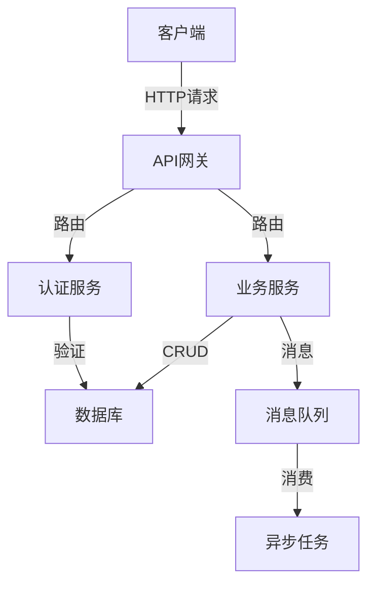

# 技术文档写作指南

## 文档体系架构

```
┌─────────────────────────────────────────────────────────┐
│                    技术文档体系                        │
├─────────────────────────────────────────────────────────┤
│  ┌──────────────┐  ┌──────────────┐  ┌──────────────┐ │
│  │  API 文档    │  │  用户指南    │  │  架构文档    │ │
│  │  API Docs    │  │  User Guide  │  │  Architecture│ │
│  └──────────────┘  └──────────────┘  └──────────────┘ │
│         │                    │                    │    │
│         ▼                    ▼                    ▼    │
│  ┌──────────────┐  ┌──────────────┐  ┌──────────────┐ │
│  │  代码注释    │  │  README      │  │  变更日志    │ │
│  │  Comments    │  │             │  │  Changelog   │ │
│  └──────────────┘  └──────────────┘  └──────────────┘ │
└─────────────────────────────────────────────────────────┘
```

## README 编写规范

### 基本结构

```markdown
# 项目名称

> 项目简介，不超过两句话

## 功能特性

- 特性 1
- 特性 2
- 特性 3

## 快速开始

### 安装

```bash
npm install package-name
```

### 用法

```javascript
import Package from 'package-name'

const instance = new Package()
instance.doSomething()
```

## API

### Class: Package

#### new Package(options)

创建一个新的 Package 实例。

**参数:**

| 参数 | 类型 | 说明 |
|------|------|------|
| options | Object | 配置选项 |
| options.debug | Boolean | 是否开启调试模式 |

#### package.doSomething()

执行某些操作。

**返回值:**

`Promise<Result>` - 操作结果

## 示例

```javascript
const package = new Package({ debug: true })
const result = await package.doSomething()
console.log(result)
```

## 许可证

MIT License
```

## API 文档规范

### 函数文档

```javascript
/**
 * 计算两个数的和
 * 
 * @param {number} a - 第一个数
 * @param {number} b - 第二个数
 * @returns {number} 两个数的和
 * @example
 * ```javascript
 * const result = add(1, 2)
 * console.log(result) // 3
 * ```
 */
function add(a, b) {
  return a + b
}
```

### 类文档

```javascript
/**
 * 用户类
 * @class
 * @classdesc 表示系统中的用户
 */
class User {
  /**
   * 创建用户
   * @param {Object} options - 用户选项
   * @param {string} options.name - 用户姓名
   * @param {number} options.age - 用户年龄
   */
  constructor(options) {
    this.name = options.name
    this.age = options.age
  }

  /**
   * 获取用户信息
   * @returns {Object} 用户信息对象
   */
  getInfo() {
    return {
      name: this.name,
      age: this.age
    }
  }
}
```

## 架构文档

### 系统架构图

```markdown


## 技术选型

| 组件 | 技术 | 版本 | 选型理由 |
|------|------|------|----------|
| 前端框架 | Vue.js | 3.x | 响应式、组合式 API |
| 构建工具 | Vite | 6.x | 快速构建、热更新 |
| 状态管理 | Pinia | 2.x | 轻量、类型安全 |
| 数据库 | PostgreSQL | 16.x | 关系型、强一致性 |
```

## 变更日志规范

```markdown
# Changelog

All notable changes to this project will be documented in this file.

The format is based on [Keep a Changelog](https://keepachangelog.com/en/1.0.0/),
and this project adheres to [Semantic Versioning](https://semver.org/spec/v2.0.0.html).

## [Unreleased]

### Added
- 新增功能 A
- 新增功能 B

### Changed
- 修改功能 C 的行为

### Deprecated
- 废弃功能 D（将在下个版本移除）

### Removed
- 移除功能 E

### Fixed
- 修复 bug F

### Security
- 修复安全漏洞 G

## [1.0.0] - 2024-01-01

### Added
- 初始版本
```

## 代码注释规范

### 单行注释

```javascript
// 计算总金额（包含税费）
const total = subtotal * (1 + taxRate)

// TODO: 后续需要支持更多支付方式
// FIXME: 这里有个 bug，需要修复
```

### 多行注释

```javascript
/*
 * 这段代码处理用户登录逻辑
 * 1. 验证用户名密码
 * 2. 生成 JWT token
 * 3. 设置会话
 */
async function login(username, password) {
  // ...
}
```

### 文件头部注释

```javascript
/**
 * @file 用户认证模块
 * @description 处理用户登录、注册、token 验证等功能
 * @author John Doe <john@example.com>
 * @version 1.0.0
 * @license MIT
 */
```

## 文档最佳实践

### 清晰的标题层级

```markdown
# 主标题

## 二级标题

### 三级标题

#### 四级标题

正文内容...
```

### 使用代码块

```javascript
// ✅ 好的代码块
function hello(name) {
  return `Hello, ${name}!`
}

// ❌ 不好的代码块
// hello() { ... }
```

### 使用表格

```markdown
| 参数 | 类型 | 默认值 | 说明 |
|------|------|--------|------|
| name | string | - | 必填，用户名 |
| age | number | 18 | 用户年龄 |
| active | boolean | true | 是否活跃 |
```

### 使用列表

```markdown
- 项目 1
- 项目 2
  - 子项目 2.1
  - 子项目 2.2
- 项目 3

1. 第一步
2. 第二步
3. 第三步
```

### 使用链接和引用

```markdown
参考 [官方文档](https://example.com/docs)

> 引用内容：这是一段重要的说明
```

## 文档工具链

```javascript
// 文档生成工具

// JSDoc - JavaScript 文档生成
// npm install -g jsdoc
// jsdoc -d docs src/

// TypeDoc - TypeScript 文档生成
// npm install typedoc
// typedoc --out docs src/

// MkDocs - 静态文档站点
// pip install mkdocs
// mkdocs serve

// Docusaurus - React 文档站点
// npx create-docusaurus@6.5.0 . classic
```

## 文档检查清单

```javascript
const docChecklist = [
  // 完整性
  '所有公共 API 是否都有文档？',
  '是否有示例代码？',
  '参数和返回值是否有说明？',
  
  // 准确性
  '文档是否与代码一致？',
  '示例代码是否可以运行？',
  '版本信息是否正确？',
  
  // 可读性
  '语言是否简洁明了？',
  '是否有适当的标题层级？',
  '代码块是否有语法高亮？',
  
  // 格式
  '是否使用 Markdown 格式？',
  '链接是否有效？',
  '表格是否正确对齐？',
  
  // 维护性
  '是否有更新日志？',
  '文档是否在版本控制中？',
  '是否有贡献指南？'
]
```

## 总结

| 文档类型 | 用途 | 工具 |
|----------|------|------|
| README | 项目介绍和快速开始 | Markdown |
| API 文档 | 接口说明和使用示例 | JSDoc/TypeDoc |
| 架构文档 | 系统设计和技术选型 | Mermaid/Diagram |
| 变更日志 | 版本变更记录 | Markdown |
| 代码注释 | 代码说明和提示 | JSDoc |
